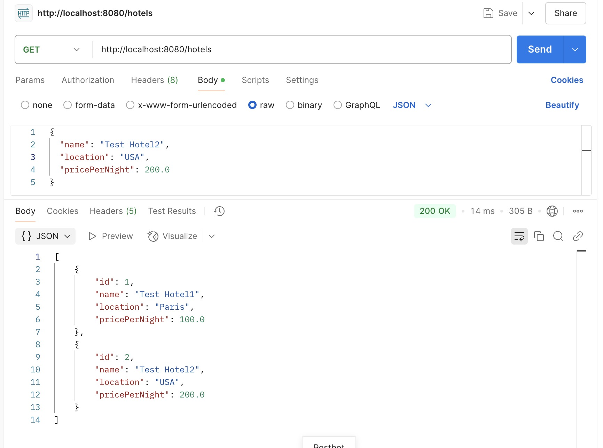
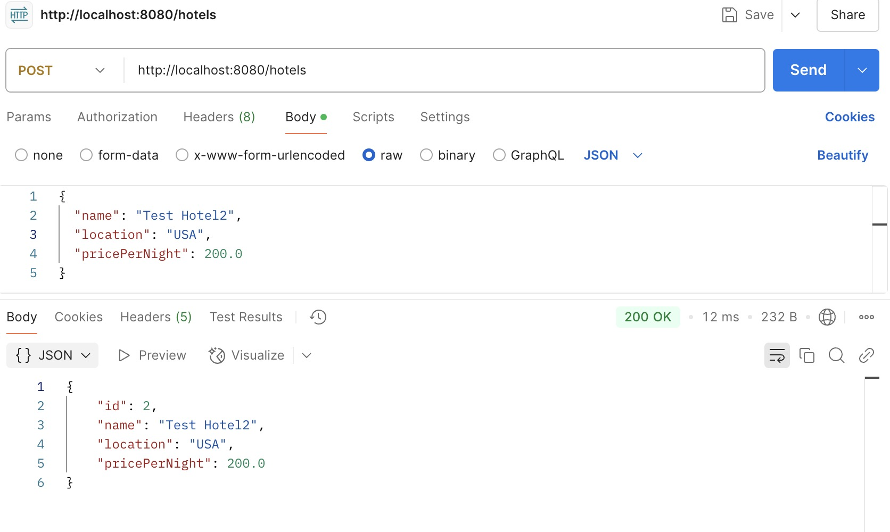

# Introduction
This is a practice project for Java Springboot. 
It is a hotel reservation system, which can get list of 
hotels available in database and add new hotel into the database.
## Run the Project
1. Clone the repository:
```angular2html
git clone https://github.com/A00488698/HotelReservationSpringboot.git
```
2. Open in IDEA:

Import the project into IntelliJ IDEA (or another IDE) as a Maven (or Gradle) project.


3. Configuration in application.properties
   Changing Spring Boot’s Default Physical Naming Strategy:
```angular2html
spring.jpa.hibernate.naming.physical-strategy=org.hibernate.boot.model.naming.PhysicalNamingStrategyStandardImpl
```
Configure the database

Use Mysql database, and configure `url`, `username`, `password` in
   `application.properties`
```angular2html
spring.datasource.url=jdbc:
spring.datasource.username=
spring.datasource.password=
```
Create Database in Navicat
```
CREATE DATABASE hotel_db;

USE hotel_db;

CREATE TABLE Hotel (
id INT AUTO_INCREMENT PRIMARY KEY,
name VARCHAR(100) NOT NULL,
location VARCHAR(255),
pricePerNight FLOAT
);
```

Other configuration in `application.properties` for Mysql:
```angular2html
spring.jpa.hibernate.ddl-auto=none
sspring.jpa.show-sql=true
```
4.	Start the application:

 IntelliJ: right-click on the main class `HotelReservationSystemApplication` and select “Run”.

### Test Pictures (Use Postman)
Use `Get` to get list of hotels available

Use `Post` to add new hotel information into the database


### Appendix
Use H2 local database first, and configure `url`, `username`, `password` in
   `application.properties`
Other configuration in `application.properties` for H2:
```
spring.datasource.url=jdbc:h2:mem:hoteldb
spring.datasource.driverClassName=org.h2.Driver
spring.datasource.username=sa
spring.datasource.password=
spring.h2.console.enabled=true
spring.jpa.hibernate.ddl-auto=update
``` 


